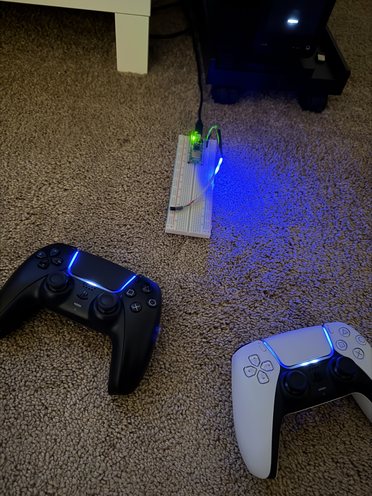
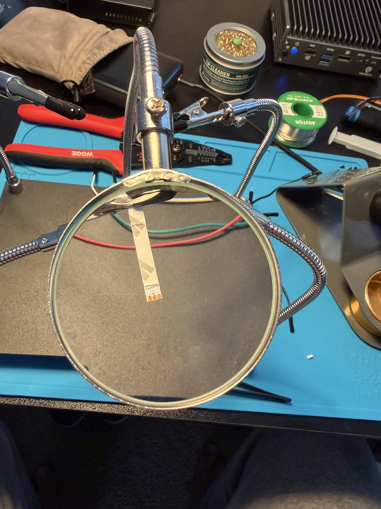
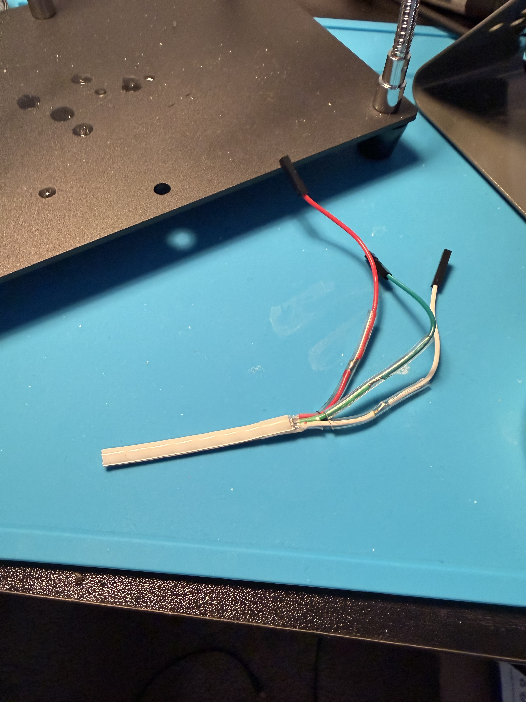
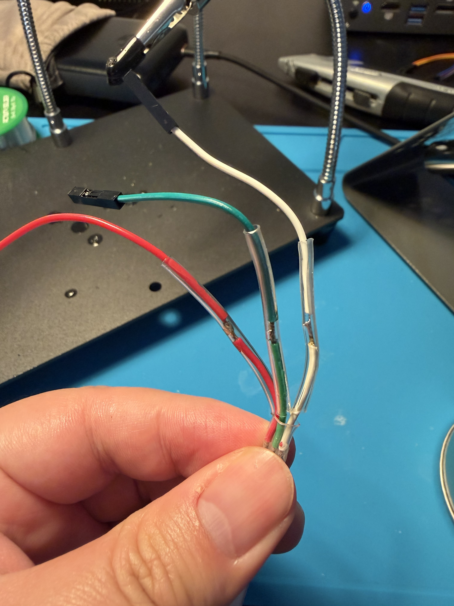
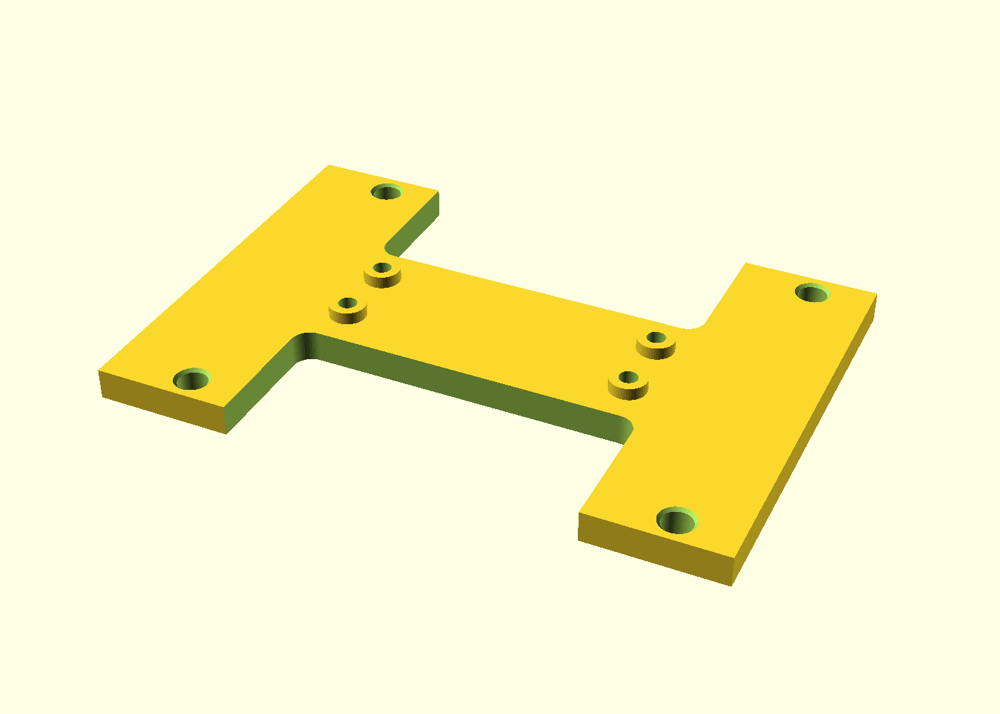
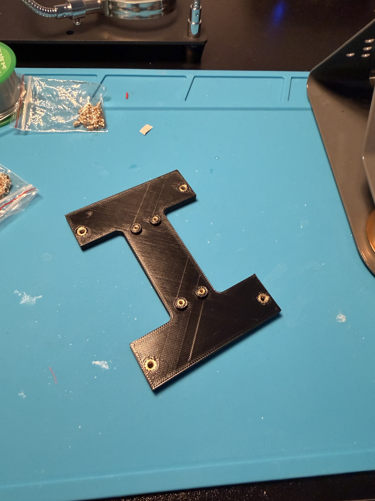
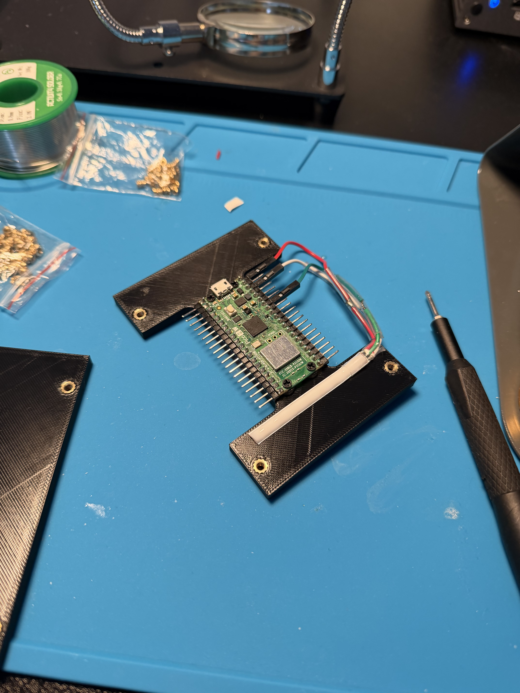
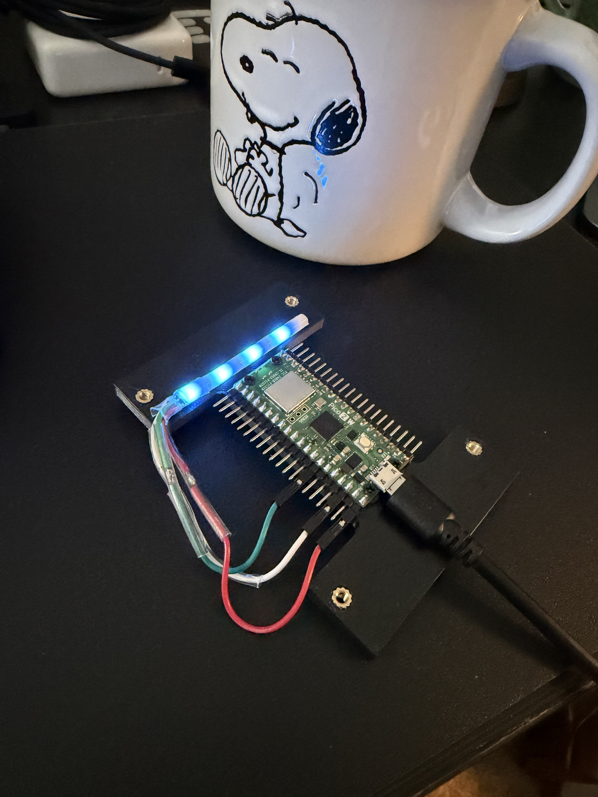
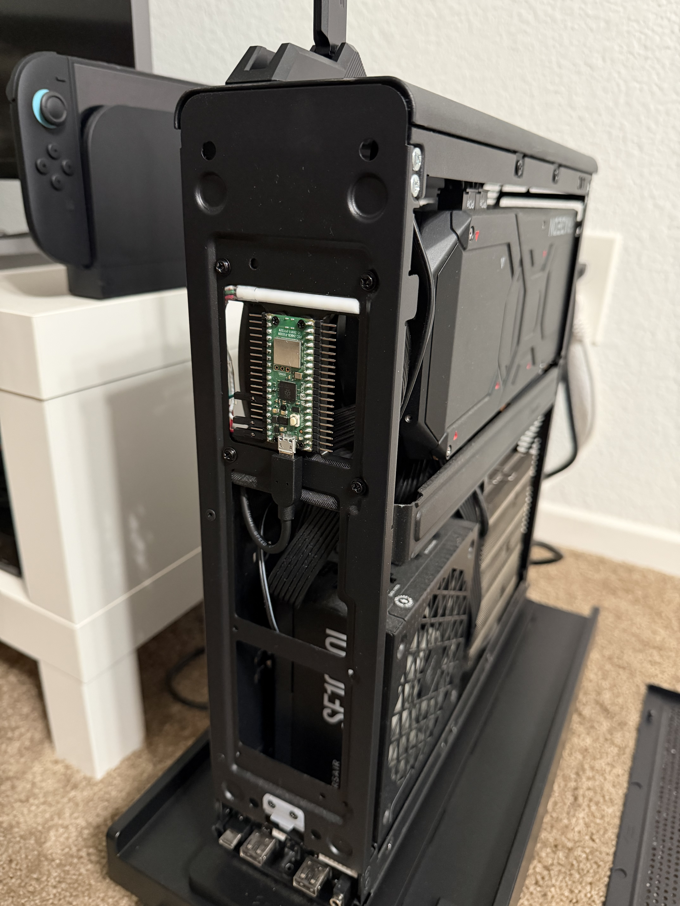
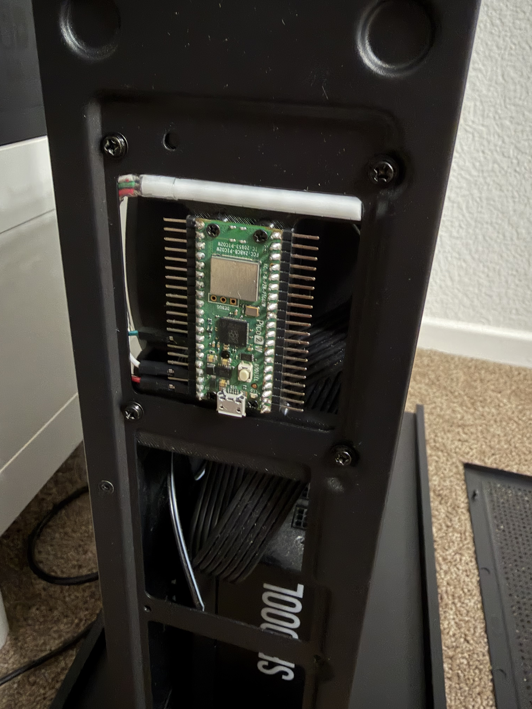

# DS5 Multi-Bridge

> **This is a personal fork of [kungaa/DS5-Linux-Bridge](https://github.com/kungaa/DS5-Linux-Bridge).**
> It carries changes suited to my own setup — most notably support for **up to
> four DualSense controllers at once** and a **WS2812B LED status strip** —
> and anyone is welcome to use it. All credit for the core firmware belongs to
> the original authors (see [Credits & License](#credits--license)); this fork
> just builds on their excellent work.

Firmware for the Raspberry Pi Pico 2 W that turns it into a latency-optimized
USB-to-Bluetooth bridge for the Sony DualSense (DS5) controller — reproducing
the wired experience (speaker, microphone, and native HD haptics) over
Bluetooth. Linux / SteamOS is the priority target; Windows works too.

See the upstream [User Guide](docs/USER_GUIDE.md) for flashing, pairing, the
config page, and OS-specific behavior and troubleshooting.

---

## What this fork adds

### Multiple controllers (up to 4)

- Up to **four DualSense / DualSense Edge controllers simultaneously** on one
  dongle. Each pad appears to the host as its own USB gamepad. Seats are
  assigned in session order (lowest free slot), like a PS5.
- **Grow-as-you-go enumeration** — the dongle enumerates with a single
  gamepad interface and only re-enumerates (one quick USB bounce) when a
  controller joins a seat the host hasn't seen yet this session. Disconnects
  never re-enumerate: a vacated seat stays visible and the next controller
  silently takes the lowest free one (so if player 1 drops, the next pad to
  connect *is* player 1). When the last controller leaves, the dongle bounces
  once back down to a single interface.
- **Feature tiers** — rumble and adaptive triggers always work on every pad.
  Controller audio (speaker, HD haptics, microphone) streams only while
  exactly **one** pad is connected; Bluetooth bandwidth can't carry audio for
  more.
- **Move controllers between slots** from the web page (each connected pad's
  row has a "move" selector). Everything that belongs to the pad follows it;
  the seat's identity (lightbar color, player LEDs) stays with the seat.
- **Per-slot player LEDs and lightbar colors** — pads show their seat number
  on the white player LEDs, and each slot's color (lightbar and status LED)
  is configurable in the UI. Default is blue (`#0000FF`) for every slot.
- **Player-LED lock** (toggle in the UI, on by default) — with 2+ pads
  connected, host writes to the player indicators are ignored so each pad
  keeps showing its slot number even when Steam Input glitchily clears them.
  With a single pad the host stays in control.
- **Black lightbar writes revert to the slot color** — a host writing pure
  black (0,0,0) would erase the seat identity; the firmware substitutes the
  slot's configured color instead. Tip: set Steam's controller LED brightness
  to 0% and Steam stops overriding slot colors entirely, while games keep
  full lightbar control.
- **Controller shortcut** — hold **PS + Triangle** for about a second to power
  off that pad (it stays paired and reconnects on the next PS press).

### WS2812B LED status strip

- Optional status LEDs driven from **GP28** (build with
  `-DENABLE_LED_STRIP=ON`), rendered via PIO at a 5% brightness cap.
- Per-slot indication (colors **and** animation — solid, blink, pulse, or
  off — configurable per state in the UI): **empty seat** = off/black by
  default, **connected** = solid slot color, **battery ≤ 40%** (discharging)
  = yellow, **battery ≤ 20%** = red, blinking by default (the one state that
  still blinks out of the box).
- **Idle** — with no controller connected (and not pairing), the strip is
  **off by default**; give the state a color and an animation (e.g. pulse
  blue) to get a "powered and waiting" display.
- **Fixed status codes** (whole strip, not configurable — see the
  [user guide](docs/USER_GUIDE.md#led-strip-status-codes)): **solid
  orange** = flash mode (UF2 bootloader), **solid red** = firmware
  crashed / boot-looping.
- **Configurable layout** — set how many LEDs the strip has (default 8, up to
  32) and click, per slot, exactly which LEDs light up. Any physical
  arrangement works: a line, a ring, a square, several LEDs per slot.
  Note: the Pico can only safely power about 8 LEDs itself; longer strips
  need an external 5 V supply (sharing ground, data stays on GP28).
- **LED debug panel** in the web UI: simulate a slot's connected/low-battery
  states, the pairing blink, and the idle breathing (without touching the
  radio or draining a pad), chase a test color down the strip, or blank it.
  Everything auto-reverts to live status after 60 s.

### Config page over USB (WebHID) — no network needed

- Open [`web/index.html`](web/index.html) in Chrome/Edge/any Chromium browser
  (from disk, or hosted anywhere — it is a single static file), press
  **Connect**, pick the *DualSense Wireless Controller* entry. The page talks
  to the plugged-in adapter over its own gamepad HID interface: no WiFi, no
  server, nothing to install. Everything below works over it, including live
  status.
- The tunnel rides on feature reports `0x80`/`0x81` — the command/response
  pair a real DualSense already has — behind a magic signature, so the USB
  HID descriptor stays byte-identical to real hardware. Protocol and command
  list: [`src/hid_config.h`](src/hid_config.h); any hidapi/Electron program
  can drive the same `/api/*` routes.
- WiFi is **Wake-on-LAN only**: enter the network under *Network* on the
  page (saved over USB). With no network saved the adapter boots with WiFi
  off and BT/USB fully up. There is no web server, mDNS or captive portal in
  the firmware at all — nothing on your LAN can reach or configure it.
- On Linux the adapter must be accessible to your user: with Steam installed
  its udev rules already cover Sony (`054c`) gamepads; otherwise add a rule
  for that vendor ID.

### Web UI

- Live **status card**: per-slot connection state, model, battery percentage
  (colored at the same 40%/20% thresholds as the strip), and which features
  are active on each pad at the current tier.
- **Sidebar navigation** — categories (Controller, Paired controllers,
  Lights, Network) down the left, one pane at a time, so the page stays
  readable as features grow.
- **Paired controllers**: connected pads show a colored **Slot N** badge,
  unnamed pads display as "DualSense" (rename to tell them apart), the list
  refreshes automatically on connect/disconnect, and a Refresh button covers
  the rest.
- **`/api/log`** — the firmware mirrors all of its diagnostics into a RAM
  buffer served as plain text (first KB of boot output kept forever, plus a
  rolling tail), so logs are readable in a browser with no UART adapter.

### Reliability & memory (fixes beyond upstream)

- **Bonds now survive reflashes** — BTstack's link-key flash bank is
  relocated off the sector the RP2350 bootrom erases on every UF2 flash
  (the same quirk that used to reset the config).
- **Safe flash writes** — all key-store flash operations run through a
  bounded, watchdog-fed, retrying path (and complete directly during
  single-core boot). The stock path could hang the main loop into a
  watchdog reboot whenever the audio core slept through the flash lockout —
  the cause of a long-standing "dongle reboots when a controller connects".
- **Deferred flash flushes during connection setup** — a flash erase
  mid-handshake stalled the feature exchange and dropped the first pairing;
  flushes now wait until no connection setup is in flight.
- **Multi-pad teardown fixed** — "Forget all" disconnects every pad
  (disconnects are queued through BTstack instead of racing its single
  HCI command buffer).
- **Memory headroom** — the heap runs ~17 KB clear of the Opus audio
  codec's ~76 KB footprint: libopus string literals (~11 KB of never-hot
  error text) stay in flash instead of joining the RAM-relocated code and
  tables, and internal buffers are right-sized. Boot prints heap telemetry
  (`[MEM]`, `[Audio] heap used`) into `/api/log` so regressions are visible.

### Build system

- **Dockerized build** with a pinned toolchain (Pico SDK 2.2.0, a pinned
  TinyUSB revision, ARM GNU 14.2) — no host toolchain installation needed.

---

## Core features (from upstream)

- **Full wireless controller emulation** — DualSense Bluetooth reports become
  a standard USB HID gamepad at up to 1000 Hz. Supports DualSense (DS5) and
  DualSense Edge (DSE), including DSE PS-app profiles.
- **Wireless HD haptics** — the cabled audio-based haptic feedback, recreated
  over Bluetooth.
- **Wireless audio** — speaker/headphone playback and microphone upload over
  standard USB Audio Class, with no Bluetooth headset-profile downgrade.
- **Hybrid hardware mic mute** — local mute via the physical Mute button,
  synced with the host sound panel.
- **On-device web config + bond management** — the adapter hosts its own
  configuration page over USB (`web/index.html` in Chrome/Edge).
- **Wake from sleep (S3 / S5)** — wake the host by turning on the controller.
- **Low-latency performance** — Bluetooth/USB/audio hot paths run from RAM to
  avoid flash cache thrashing.
- **USB 3.0 RF-noise watchdog** — auto-retries Bluetooth connections stalled
  by 2.4 GHz interference from USB 3.0 ports (USB 2.0 ports recommended).

---

## Quick start

1. **Flash** — hold **BOOTSEL** on the Pico 2 W, plug it into USB, and drop
   the `.uf2` onto the mounted `RP2350` volume.
2. **Pair** — put the DualSense in pairing mode (hold **Share + PS** until the
   lightbar double-blinks). To add more controllers, use **Pair new
   controller** on the config page.
3. **Configure** *(optional)* — open `web/index.html` in a Chromium browser, press Connect, to change
   settings, colors, the LED layout, or paired controllers.

---

## Building

### Docker (recommended)

The only requirement is a running Docker engine (Docker Desktop, OrbStack,
or plain `docker`). The first build creates the toolchain image; after that
builds are incremental.

```bash
./docker/build.sh pico2_w
```

Output lands at `build/docker-pico2_w/ds5-bridge.uf2`. Extra CMake options
pass straight through:

```bash
# This fork's typical build: 4 slots + LED strip on GP28
./docker/build.sh pico2_w -DENABLE_LED_STRIP=ON

# Other examples
./docker/build.sh pico2_w -DMULTI_SLOT_COUNT=2          # fewer controller slots
./docker/build.sh pico2_w -DLED_STRIP_GPIO=2 -DENABLE_LED_STRIP=ON
./docker/build.sh pico_w                                # Pico W (RP2040, no audio)
./docker/build.sh waveshare                             # Waveshare RP2350B-Plus-W
```

Useful options:

| Option | Default | Meaning |
| --- | --- | --- |
| `MULTI_SLOT_COUNT` | `4` | Concurrent controller slots (1-4). |
| `ENABLE_LED_STRIP` | `OFF` | WS2812B controller-status LEDs via PIO. |
| `LED_STRIP_GPIO` | `28` | GPIO for the strip's data line. |
| `ENABLE_WIFI_WOL` | `ON` | On-device config web page over WiFi + Wake-on-LAN. |
| `ENABLE_BATT_LED` | `ON` | Onboard-LED low-battery blink. |
| `ENABLE_VERBOSE` | `OFF` | Louder UART logs. |

### Build directories

Every invocation configures and builds in its own `build/docker-<name>`
directory, and the CMake cache there **remembers the `-D` flags** — so after
the first configure, re-running the same command (or just
`cmake --build build/docker-<name>` inside the toolchain image) rebuilds the
same configuration incrementally. To keep a differently-flagged flavor of
the same board without clobbering its default directory, name it with
`BUILD_NAME`.

The configurations maintained in this repo:

| Directory | What it's for | Reproduce with |
| --- | --- | --- |
| `build/docker-pico2_w` | **The daily-driver build**: Pico 2 W, 4 controller slots, WS2812B strip on GP28. This is the UF2 to grab for the multi-controller dongle. | `./docker/build.sh pico2_w -DENABLE_LED_STRIP=ON` |
| `build/docker-ms1` | Single-controller flavor of the same board (`ms1` = multi-slot 1): upstream-like one-pad behavior, no LED strip. For A/B-testing regressions against single-slot behavior. | `BUILD_NAME=ms1 ./docker/build.sh pico2_w -DMULTI_SLOT_COUNT=1` |
| `build/docker-pico_w` | Pico W (RP2040) board target — no audio. | `./docker/build.sh pico_w` |
| `build/docker-waveshare` | Waveshare RP2350B-Plus-W board target. | `./docker/build.sh waveshare` |

The flashable image is always `<directory>/ds5-bridge.uf2`.

### Native

The standard Pico SDK CMake flow also works if you have the toolchain set up
(make sure the SDK's TinyUSB checkout matches the revision pinned in
`docker/Dockerfile`):

```bash
mkdir build && cd build
cmake -DCMAKE_BUILD_TYPE=Release ..
make
```

Build `Release`; `Debug` (`-O0`) causes audio crackling.

### Board targets

| Board | Configure with | Notes |
| --- | --- | --- |
| Raspberry Pi Pico 2 W (RP2350) | *(default)* | Full feature set. |
| Waveshare RP2350B-Plus-W | `-DWAVESHARE_RP2350B_PLUS_W_BUILD=ON` | USB-C, 16 MB flash, RM2 wireless. |
| Raspberry Pi Pico W (RP2040) | `-DPICO_W_BUILD=ON` | Legacy RP2040; **no audio** (gamepad + haptics only). |

---

## Debugging

There is **no USB serial port** — USB-CDC was removed because it shares the
USB stack with the audio isochronous endpoints and perturbs the very timing
you need to measure. Diagnostic output goes to **UART0** instead:

- **Pico GP0 (pin 1)** = UART TX, connect to your USB-serial adapter's **RX**
- **Pico GND (pin 3)** to adapter **GND**
- Settings: **115200 baud, 8N1**, no flow control (3.3 V logic — do not feed
  5 V into GP0)

---

## 3D-printed case mount

[openscad/](openscad/) contains a printable bracket
([pico_25_bracket.scad](openscad/pico_25_bracket.scad), with a ready-to-slice
[STL](openscad/pico_25_bracket.stl)) that mounts the Pico inside a PC case
using a standard **2.5" drive (SFF-8201) bottom mounting pattern** — designed
around a Fractal panel, but the footprint fits any 2.5" bay:

- The plate screws to the inside of the case's inner sheet via **M3×4×5
  heat-set inserts**; the Pico sits on standoffs on the outward face and pokes
  through the panel opening, its PCB top landing flush with the panel's outer
  relief surface.
- The Pico screws down with **M2 screws into M2×4×3.2 heat-set inserts** in
  the standoff tips.
- The I-shaped side cutouts leave the sides open so the LED-strip wires and
  DuPont connectors tuck behind the bracket.
- Sheet thickness, relief depth, insert bores, and the Pico's position are
  all parameters at the top of the `.scad` file — print flat face down
  (standoffs and insert holes up).

> **Known limitation:** the bracket doesn't yet leave clearance for a thick
> micro-USB cable — the current design assumes a slim plug. A future revision
> needs to accommodate bulkier cable housings.

---

## Build gallery

From breadboard prototype to a dongle mounted in the PC case.

<table>
  <tr>
    <td width="50%">
      <br>
      <sub>Early breadboard prototype driving two DualSense controllers at once, with the WS2812B strip showing slot status.</sub>
    </td>
    <td width="50%">
      <br>
      <sub>Soldering leads onto a short WS2812B strip segment.</sub>
    </td>
  </tr>
  <tr>
    <td width="50%">
      <br>
      <sub>The finished strip harness — 5&nbsp;V, ground, and GP28 data, heat-shrunk to jumper connectors.</sub>
    </td>
    <td width="50%">
      <br>
      <sub>Close-up of the solder joints before the final heat-shrink pass.</sub>
    </td>
  </tr>
  <tr>
    <td width="50%">
      <br>
      <sub>OpenSCAD render of the <a href="openscad/pico_25_bracket.scad">case-mount bracket</a>.</sub>
    </td>
    <td width="50%">
      <br>
      <sub>The printed bracket with the brass heat-set inserts installed.</sub>
    </td>
  </tr>
  <tr>
    <td width="50%">
      <br>
      <sub>Pico 2&nbsp;W and the strip assembled onto the bracket.</sub>
    </td>
    <td width="50%">
      <br>
      <sub>First power-on of the assembled unit — slot LEDs lit in the default blue.</sub>
    </td>
  </tr>
  <tr>
    <td width="50%">
      <br>
      <sub>Mounted to the case's 2.5" drive pattern, wired to an internal USB port.</sub>
    </td>
    <td width="50%">
      <br>
      <sub>The Pico 2&nbsp;W poking through the panel opening, flush with the outer surface.</sub>
    </td>
  </tr>
</table>

---

## Credits & License

This fork stands on two projects' shoulders:

- **[DS5-Linux-Bridge](https://github.com/kungaa/DS5-Linux-Bridge)** by
  **kungaa** — the direct upstream: the Linux-first fork that added the
  on-device web config, bond management, the Decky Loader companion plugin,
  and extensive Linux tuning. If this firmware is useful to you, consider
  [supporting kungaa on Ko-fi](https://ko-fi.com/mkungaa).
- **[DS5Dongle](https://github.com/awalol/DS5Dongle)** by **awalol** — the
  original project that made all of this possible: the DualSense bridge
  core, HD haptics over Bluetooth, and the low-latency architecture.

This project is licensed under the **GNU General Public License v3.0** — see
[LICENSE](LICENSE). Portions of the source originate from awalol's
MIT-licensed work; the original MIT notice is preserved in
[LICENSE-MIT](LICENSE-MIT) as that license requires.
